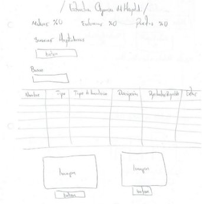
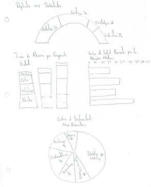

Administración de Base de Datos

# Introducción 

Este documento introduce a la estructura base en el desarrollo del sitio web de un Hospital, integrando en función elementos aplicados y estructurados, los cuales dependen de un servicio integral o base para poder ser desarrollado. 

Se abordará una estructura basada en el desarrollo rápido y preciso con base a herramientas como lo es Django, enfocado al desarrollo Front-end y Back-end, siendo un frameworks versátil para el maquetado y estructura del sitio, englobado aplicaciones integradas ya en su funcionamiento, esto aligerar la carga de desarrollar más procedimientos y estructuras que podrían llevar semanas en su diseño y funcionamiento.

Se utilizará herramientas de maquetado web como lo es Bootstrap y plantillas de diseño prediseñadas para armar el contexto que se desea aplicar al proyecto.

Al ser un proyecto dependiente de información almacenada, se estructurará con una base de datos diseñada desde el mismo Django y aplicándolo a MySQL para su gestión.

Las aplicaciones de hoy en se desarrollan con procedimientos que le permita manejar errores en la verificación de datos, es por ello que dentro del proyecto se implantara las funciones necesarias que salvaguarden la información, pensado en una correcta estructuración y maquetación del sitio web.

# Sketch

Esta es la propuesta de inicio de la Dirección general del hospital, en la parte superior o heder se incorpora el nombre y una imagen descriptiva.

En la parte centrar o Body se incorporan cuatro imágenes representativas de las áreas involucradas en la gestión de la Dirección General del Hospital.

En la parte inferior o Footer se incorpora una descripción de las actividades que realiza el área de dirección general, debajo se agregan los enlaces de contacto y enlaces a redes sociales y correo electrónico.

La siguiente sección corresponde a la atención de solicitudes, de acuerdo a la demanda del hospital en él se atenderá y registraran todos los movimientos solicitados de los departamentos al área de dirección general del hospital, el cual dará el visto bueno. 

La siguiente vista se ejemplifica con la consulta de información de los servicios hospitalarios, esta estructura será idéntica a la de Servicios Médicos, que servirán como fuentes de información vinculadas a los departamentos que vigila la dirección general del hospital.

De igual esta estructura tendrá la vista de Bitácora.

En la parte inferior se representan cuadros de imágenes que vincularan a las áreas involucradas en la dirección general para un acceso rápido.

La estructura del Dashboard general del hospital puede ser compleja de acuerdo a la cantidad de gráficos que se pretende implementar, sin embargo, es posible agregar más a la vista englobando y especificando con detalle los datos de las áreas a las que hace mención, en la representación se pretende organizar los gráficos de tal forma que su estructura se vincule con los servicios que ofrece el hospital general y las estadísticas que permitan mejorar la calidad de atención hacia sus pacientes. 
# Wireframe	

Imagen

Imagen

Imagen

Imagen

Imagen

Botón

Botón

Botón

Botón

Texto

Contacto

Enlaces

Gráfico

Imagen

Imagen

Imagen

Botón

Botón

Botón

||||||||
| :- | :- | :- | :- | :- | :- | :- |
||||||||
||||||||
||||||||
||||||||
||||||||
||||||||
||||||||
||||||||
||||||||
||||||||
||||||||
||||||||
||||||||
||||||||

Guardar

|||||||
| :- | :- | :- | :- | :- | :- |
|||||||
|||||||
|||||||
|||||||
|||||||
|||||||
|||||||
|||||||
|||||||
|||||||
|||||||
|||||||
|||||||
|||||||
|||||||
|||||||
|||||||
|||||||
|||||||
|||||||
|||||||
|||||||

Gráfico

Imagen

Imagen

Botón

Botón

Botón
![ref1]![ref2]![ref3]![ref4]

||||||||
| :- | :- | :- | :- | :- | :- | :- |
||||||||
||||||||
||||||||
||||||||
||||||||
||||||||
||||||||
||||||||
||||||||
||||||||
||||||||
||||||||
||||||||
||||||||
||||||||
||||||||
||||||||
||||||||
||||||||
||||||||
||||||||
||||||||

Gráfico

Imagen

Imagen

Botón

Botón

Botón
![ref1]![ref2]![ref3]![ref4]

Gráfico

Imagen

Imagen

Botón

Botón

![ref2]
||||||
| :- | :- | :- | :- | :- |
||||||
||||||
||||||
||||||
||||||
||||||
||||||
||||||
||||||
||||||
||||||
||||||
||||||
||||||
||||||
||||||
||||||
||||||
||||||
||||||
||||||
||||||
||||||
||||||
||||||
||||||

![ref3]

Gráfico por categoría

Gráfico de Vértices 

Gráfico Pastel

Gráfico Dona

Gráfico 

Gráfico curvas

Gráfico barras

![ref5]

Gráfico de puntos

	

Gráfico de Vértices 

Gráfico de barras seccionadas por color

Gráfico de barras comparativas

Gráfico barras y trayectoria

![ref5]

Gráfico de media luna

Gráfico de disponibilidad

Gráfico de trayectoria

	

Gráfico de escalas temporales

Gráfico de escalas temporales 

Botón

Botón

Botón

Imagen

Imagen

Imagen

Gráfico de Pastel 3D

Gráfico radar

![ref6]![ref6]![ref7]![ref8]![ref9]

Las vistas ejemplificadas muestran la distribución en configuración propuesta en los Sketch, lo que permitirá maquetar dentro de Vue.js los elementos necesarios y requeridos para crear la sección de la Dirección general del Hospital. 

A continuación, se muestran las estructuras ya maquetadas en Vue.js con base a los Sketch y Mockups propuestos con anterioridad.

# Mockup

	

El siguiente paso es realizar la funcionalidad de cada campo, sin embargo, es necesario analizar de nuevo que es lo que se requiere y es más importante en la integración de las vistas finales de la sección de Dirección General del hospital.
18 | Página

[ref1]: Aspose.Words.20380c9f-c276-45a3-8eb3-b9011bc48036.018.png
[ref2]: Aspose.Words.20380c9f-c276-45a3-8eb3-b9011bc48036.019.png
[ref3]: Aspose.Words.20380c9f-c276-45a3-8eb3-b9011bc48036.020.png
[ref4]: Aspose.Words.20380c9f-c276-45a3-8eb3-b9011bc48036.021.png
[ref5]: Aspose.Words.20380c9f-c276-45a3-8eb3-b9011bc48036.029.png
[ref6]: Aspose.Words.20380c9f-c276-45a3-8eb3-b9011bc48036.061.png
[ref7]: Aspose.Words.20380c9f-c276-45a3-8eb3-b9011bc48036.065.png
[ref8]: Aspose.Words.20380c9f-c276-45a3-8eb3-b9011bc48036.066.png
[ref9]: Aspose.Words.20380c9f-c276-45a3-8eb3-b9011bc48036.067.png
