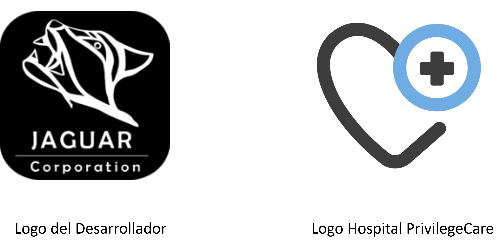
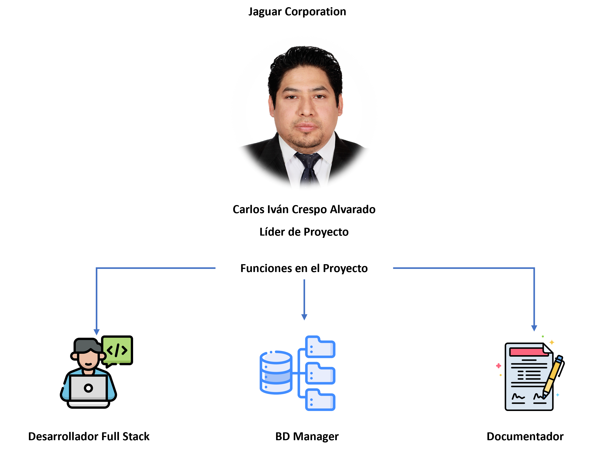
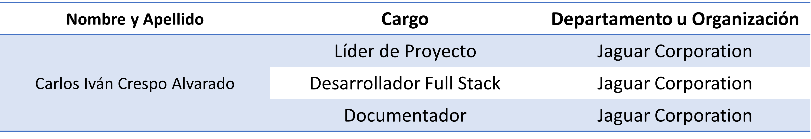

# Jaguar Corporation 

| |
| -------------------------- |
| Logos |

## Organigrama del Equipo: 

 

 
 

## Objetivos Generales y Específicos

Los servicios de hoy se han adaptado a la mejora constante de los recursos digitales, sin embargo, hay algunos modelos de negocios que se reúsan al cambio de dirección y coordinación de la modularidad de sus servicios, es por ello que el cambio podría afectar el modelo para mejorar su capacidad de organización, y es claro el enfoque a la modernidad puede pesar un poco de dependiendo a la capacidad de aprender de los sectores. El área medica no es la excepción, desde muchos años el sector salud ha tenido muy poco desarrollo y actualización en sus procesos de atención y esto es por las siguientes causas:
La mayoría de los servicios que se prestan en un hospital deben de ser atendidos de manera inmediata sin retraso, ya que los servicios que se brindan dependen de la óptima atención de los detalles para resolver los casos médicos.
El uso de la tecnología en la rama medica ha dado brincos altos, pero solo en las áreas de aplicación y procedimientos, no en la gestión de como debe de llevar su manera de trabajo. 
Los servicios que en la actualidad están disponibles se han implementado en el sector privado y público, son demasiado caros para adquirirlos y mas aun llevar un control en su mantenimiento, sin embargo, se podría solventar el flujo de información que se genera en un hospital para acelerar el proceso de automatización y análisis oportuno de la documentación generada por cada paciente, área, procedimientos, tratamiento e historial clínico más detallado, disponible en todo momento con una actualización con la documentación mas reciente de los procedimientos médicos realizados de cada uno de los pacientes, así como el control de la medicación, intervenciones quirúrgicas y tratamientos, así como un historial mas detallado desde la niñes hasta la adultes.  

El trabajo seria manejar la información disponible generada en un hospital para optimizar mejor las áreas que lo requieran, así se agilizarían mejor los procesos administrativos que pueden afectar la atención oportuna de los pacientes, así como la mejora de la calidad de salud de estos. Tanto el personal de atención médica (médicos generales, enfermeras, especialistas, químicos, técnicos, ingenieros, licenciados legales, psicólogos, personal auxiliar y voluntarios), estarían involucrados directamente en la dinámica de la administración oportuna del hospital.

Desarrollar un sitio web para el área medica con capacidad de generar registros de todas las áreas y departamentos involucrados en la gestión y organización, permitiendo generar datos precisos y contundentes para un control de calidad en los procesos de generación de los datos de pacientes, personal médico, proveedores de servicios externos, insumos médicos y correcto manejo en el flujo de personal a las áreas de mayor demanda, es así que con las herramientas tecnológicas a utilizar en el desarrollo como lo son Django como frameword de desarrollo para la API, MySQL para el control de la base de datos y React para el desarrollo Frontend generaran un concepto que permitirá maquetar la estructura básica del diseño para la generación de la información y el consumo de la información. 

Los equipos en conjunto se encargarán de desarrollar áreas especificas del proyecto divididos en 7 sectores o departamentos, la información de la organización esta pensada para que cada sector pueda conectarse de manera precisa para responder a las necesidades del hospital, sin embargo, existen áreas especificas en donde la interacción puede ser limitada o nula de acuerdo a las acciones determinadas y solicitadas de los departamentos. 

## Contexto de negocio

La gestión de un hospital puede abarcar varios sectores de la población a la que dirige sus servicios,  el modelo al enfoque de los servicios de alta calidad esta reservado para los hospitales privados donde por una cuota trimestral, seguro o plan anual, están obligados a ofrecer sus servicios con los estándares de calidad mas altos, sin embargo como se menciono  en un principio el sector de población de atención para este tipo se limita al valor  adquisitivo de sus clientes, por ende sus procesos de demanda no son tan exigentes como lo serian en el sector público.  

El nivel de atención en el sector publico se determina por la cantidad de pacientes que puede atender el hospital ofreciendo una amplia gama de servicios, ya sea para su derecho habientes inscritos en patrón de Seguro Social Nacional (SSN) o con consultas internas o externas dentro de, demás de incluir el compromiso de atención a todos aquellos que lo necesitan mediante una canalización de otras unidades medicas conectadas a la misma institución del Seguro Social, retomando el modelo de organización es importante que cada área este definida para poder dar un oportuno servicio a los derecho habientes, lo que puede ser complicado con la documentación innecesaria y procedimientos que retrasen a un más la atención de pacientes con enfermedades crónicas degenerativas. Sin contar la negligencia de personal que no esta altamente capacitado para dar un correcto servicio y manejo de la información de los pacientes. 

Un hospital publico se asocia con el sector comunitario y campañas gubernamentales, con las que promueve visitas a la comunidad mediante campañas de vacunación, donación de sangre, platicas de prevención y atención oportuna de enfermedades crónico degenerativas, concientización e información de enfermedades de contagio sexual, planificación familiar, tramites de registro poblacional y difusión de consulta gratuita para el sector mas vulnerable. Aquí es donde participa el sector privado que dona material para la atención medica del sector mas vulnerable, y haciendo alianzas de difusión para la mejora de la calidad de vida de las personas. Aunque algunas veces puede ser difícil abarcar a todo el sector, debido a la gran demanda de la solicitud de una atención medica de calidad. 

Los hospitales públicos están administrados por el gobierno mediante el surtido de su inventario, además algunas empresas contratadas por el gobierno se encargan de suministrar el material clínico y quirúrgico que necesita para la operación y atención de sus actividades, como también de otorgar el equipamiento necesario para poder trabajar en la atención de los pacientes, lo que nos lleva a que puede existir un desequilibrio en la gestión de los procesos por falta de utilización y administración de los bienes y recursos de un hospital, además que no hay un control, hacen más ineficiente la atención del público, lo que genera grandes conflictos en la calidad del servicio, es por ello que de manera más humana los médicos llegan a comprar el material para poder ayudar a sus pacientes. Estos problemas generados se dan por una mala administración en la gestión de los recursos por una inexistencia de solicitudes y un sistema que los esté administrando.

El sector privado es financiado por asociaciones privadas como lo son agencias de seguros y bancarias que influyen en sus clientes para la contratación de sus servicios haciendo una relación ganar – ganar, siendo su mayor activo la influencia en los medios masivos de comunicación y en la propagación de publicidad y “promociones“, para la adquisición de paquetes de cobertura de atención médica, aunque algunas entidades realizan actos de caridad y de responsabilidad civil para la sociedad creando fundaciones de captación de donativos públicos y privados, tratan de ayudar a las personas que mas lo necesitan, estas fundaciones de atención se especializan en sectores más vulnerables de la población como lo son los hospitales de tratamiento de enfermedades crónico degenerativas como lo es cáncer en todos sus ramos y tratamientos de enfermedades de trasmisión sexual (VIH), estos son algunos ejemplos donde su modelo no es ganar  - ganar, sino mejorar su relación con el sector poblacional de la región donde estén dando el servicio.

En el ámbito público las reglas son muy diferentes, aquí toda la relación interna y externa dependerá de la planeación estratégica mediante los modelos de estudio de poblaciones a nivel epidemiológico dando un seguimiento a los factores de atención mas importantes para su atención entre los que se incluyen, atención a enfermedades crónico degenerativas, atención a adicciones, consulta médica, tratamientos y un diagnóstico oportuno, todo en base a estudios constantes de sus pacientes inscritos en su patrón, es por ello que al detectar pacientes con una relevancia importante de atención son canalizados a las áreas de especialización para seguir su tratamiento, lo que puede llevar a un periodo de espera largo para su oportuna atención, al ser un sector saturado, toma con más relevancia a casos con mayor importancia de atención, lo que podría dejar vulnerables las áreas mas importantes de atención, sin embargo cada unidad depende de una regulación de operación mediante la autoridad clínica estatal y federal que revisan constante mente el comportamiento del sistema y la gestión de sus procesos.

Las normas para operación son mas estrictas para el área pública que en la privada ya que la entidad federal es la que debe de dar el visto bueno para su operación ajustando las actividades a las normas y convenciones establecidas para su operación como lo son las normas NOM 035 SSA3 2012 , NOM 027 SSA3 2013 entre otras que establecen los criterios y procedimientos que se deben de seguir para la producción, captación, integración, procesar, sistematizar, evaluar y divulgar la información en salud, además de establecer los criterios de funcionamiento y atención en los servicios de urgencias encada establecimiento de atención médica. 

En el sector publico el financiamiento esta atado al presupuesto anual federal del país, por lo que las mejoras de los bienes y servicios para el sector están programadas de manera anual y bimestral para todos los centros de atención, siendo los de mayor relevancia los centros de primer nivel, segundo nivel y tercer nivel de atención pública.  
Sin embargo las actualizaciones pueden ser pocas o debido a que la infraestructura necesaria para sustentar la demanda puede ser de bajo impacto, por lo que es imprescindible optimizar la manera de responder a la demanda de los procesos, es así como se busca una oportunidad dentro de ese sector de atención pública buscando solventar y optimizar algunos procesos de gestión que desahoguen la carga de trabajo, como lo son el manejo de inventarios, documentación y expedición de expedientes que faciliten el manejo de casos clínicos, gestión de personal en turno, manejo de expedición de estudios clínicos, como control de medicamentos y medicación hacia los pacientes, como una mejor optimización de conexión de la organización del hospital en tiempo real que ahorren el traslado de información hacia todos los departamentos existente en la instancia clínica, es así que salvo guardando la expedición de documentos se guardara aun mas el secreto clínico de los datos de los pacientes como un oportuna carpeta de documentación actualizada de manera digital, toda la información que ingrese al sistema esta monitoreada constante por personal capacitado para solventar los problemas que se ejecuten en la solicitud especifica de cierta formación. 

Todo lo mencionado estará sujeto a las políticas existentes para el manejo de la información y protección de datos, por lo que es importante la implementación de la seguridad informática encriptando la información confidencial que pudiese ser tomada por personal ajeno al autorizado, sin embargo, esto dependerá del nivel de seguridad que se dese implementar. 

## Organigrama de la empresa

Este organigrama proporciona una estructura general para un hospital, puede adaptarse
según las necesidades específicas de cada hospital o cada clínica. Las áreas principales,
como Dirección General, Subdirección médica, subdirección administrativa, departamento
de calidad, Finanzas y Recursos Humanos aseguran una gestión eficiente del hospital,
abordando tanto las necesidades operativas como las estratégicas para el éxito de la clínica

## Requerimientos funcionales

|**Código** |**Tipo de requisito** |**Descripción del requisito** |
| - | - | - |
|**RF1** |Requisito funcional |El  sistema  debe  permitir  el  registro  de  nuevos  pacientes, capturando información personal y médica relevante. |
|**RF2** |Requisito funcional |Asignación de un identificador único para cada registro. |
|**RF3** |Requisito funcional |El sistema debe permitir a los médicos acceder y actualizar los registros médicos de los pacientes durante las consultas. |
|**RF4** |Requisito funcional |Capacidades de búsqueda y filtrado eficientes. |
|**RF5** |Requisito funcional |Almacenar y acceder a imágenes médicas como radiografías y resonancias magnéticas. |
|**RF6** |Requisito funcional |Permitir  la  exportación  e  importación  de  datos  en  formatos estándar  para  facilitar  la  migración  de  datos  y  compartir información con otros sistemas. |
|**RF7** |Requisito funcional |El  sistema  debe  permitir  el  registro  de  nuevos  pacientes, incluyendo  información  básica  como  nombre,  fecha  de nacimiento, género, dirección y datos de contacto. |
|**RF8** |Requisito funcional |El  sistema  debe  mantener  un  historial  detallado  de  los medicamentos recetados a lo largo del tiempo. |
|**RF9** |Requisito funcional |El  sistema  debe  permitir  la  generación  de  informes personalizados basados en datos de expedientes médicos y notas médicas para análisis clínico, auditorías y presentación de informes. |
|**RF10** |Requisito funcional |El sistema debe mantener un registro de auditoría que registre todas las actividades de acceso y modificaciones realizadas en los expedientes médicos y notas médicas, incluyendo detalles sobre quién accedió y cuándo. |
|**RF11** |Requisito funcional |El  sistema  debe  permitir  la  personalización  y  configuración según  las  necesidades  específicas  de la  institución  médica, incluyendo la capacidad de agregar campos personalizados, formularios y flujos de trabajo específicos. |
|**RF12** |Requisito funcional |Los  usuarios  autorizados  deben  poder  acceder  al  historial completo de expedientes médicos y notas médicas de cada paciente para revisión y análisis. |
|**RF13** |Requisito funcional |El sistema debe permitir la creación y gestión de  diferentes perfiles de usuario, como médicos, personal administrativo y pacientes,  cada  uno  con  diferentes  niveles  de  acceso  y privilegios. |
|**RF14** |Requisito funcional |Ofrecer funciones de anonimización de datos para permitir el uso de información para investigaciones sin comprometer la privacidad de los pacientes. |
|**RF15** |Requisito funcional |Permitir la inclusión y gestión de archivos adjuntos en las notas médicas, como informes de laboratorio, imágenes médicas u otros documentos relevantes. |

## Requerimientos no funcionales

|**Código** |**Tipo de requisito** |**Descripción del requisito** |
| - | - | - |
|**RF1** |Requisito no funcional |El sistema debe garantizar tiempos de respuesta rápidos, incluso en situaciones de carga máxima, para evitar demoras en la atención médica. |
|**RF2** |Requisito no funcional |Garantizar que la interfaz de usuario sea fácil de usar y comprender. |
|**RF3** |Requisito no funcional |La interfaz de usuario debe ser intuitiva y fácil de usar, facilitando la adopción por parte del personal médico con di- ferentes niveles de experiencia técnica. |
|**RF4** |Requisito no funcional |El sistema debe cumplir con regulaciones y normativas lo- cales e internacionales en materia de privacidad y seguridad de datos médicos. |
|**RF5** |Requisito no funcional |Se deben realizar pruebas de usabilidad periódicas con el personal médico para identificar posibles mejoras en la interfaz.|
|**RF6** |Requisito no funcional |Registro y seguimiento de la evolución de pacientes en programas de rehabilitación y terapia física. |
|**RF7** |Requisito no funcional |Se debe mantener un registro detallado de las actividades realizadas en el sistema, facilitando la auditoría y la iden- tificación de posibles problemas de seguridad. |
|**RF8** |Requisito no funcional |Proporcionar materiales de formación y documentación para los usuarios, asegurando que comprendan cómo utilizar el sistema de manera efectiva y segura. |
|**RF9** |Requisito no funcional |Permitir actualizaciones del sistema sin interrupciones sig- nificativas en el servicio, especialmente durante momentos críticos de atención médica. |
|**RF10** |Requisito no funcional |Implementar  mecanismos  de  validación  de  datos  para asegurar la precisión y coherencia de la información ingresada en los registros médicos. |

## Reglas de negocio

|***Código*** |**Reglas** |
| - | - |
|**RN1** |Confidencialidad de la Información: Los datos médicos de los pacientes deben ser tratados con confidencialidad y solo accesibles por personal autorizado. |
|**RN2** |Antes de acceder al expediente médico de un paciente, el personal médico debe obtener el consentimiento informado del paciente o su representante legal. |
|**RN3** |Registro Completo de Datos: Todo encuentro médico debe registrarse de manera completa y precisa en el expediente médico del paciente. |
|**RN4** |Actualización Regular: Los expedientes médicos y las notas médicas deben actualizarse regularmente para reflejar con precisión el historial médico y las condiciones actuales del paciente. |
|**RN5** |Consistencia en la Terminología: Se debe utilizar una terminología médica estandarizada y consistente en todos los registros médicos para facilitar la comprensión y el intercambio de información entre profesionales de la salud. |
|**RN6** |Registro de Auditoría: Se debe mantener un registro de auditoría que registre todas las actividades realizadas en el sistema, incluyendo quién accedió a qué información y cuándo. |
|**RN7** |Restricciones de Acceso por Roles: El acceso a la información médica debe estar restringido según el rol y los privilegios del usuario, limitando el acceso a la información relevante para su función. |
|**RN8** |Integración de Resultados de Laboratorio: Los resultados de pruebas de laboratorio y otros estudios diagnósticos deben integrarse automáticamente en el expediente médico del paciente. |
|**RN9** |Consistencia en el Formato de Notas Médicas: Las notas médicas deben seguir un formato estándar y consistente para facilitar la comprensión y el análisis. |
|**RN10** |Deben registrarse y asociarse los resultados de pruebas de laboratorio a las historias clínicas de los pacientes. |
|**RN11** |Deben  registrarse  de  manera  detallada  las  intervenciones  quirúrgicas, incluyendo fechas, procedimientos y profesionales involucrados. |
|**RN12**|El sistema debe permitir la generación de informes médicos para su revisión interna o entrega a pacientes |
|**RN13** |Se debe mantener un registro detallado de quién accede a los registros médicos y cualquier modificación realizada |
|**RN14** |Proporcionar capacitación regular al personal médico sobre las políticas y procedimientos relacionados con la gestión de registros médicos. |
|**RN15** |Establecer alertas y notificaciones automáticas para eventos críticos, como resultados de laboratorio anómalos o cambios significativos en el estado de salud del paciente. |
|**RN16** |Implementar regularmente copias de seguridad de los registros médicos para garantizar la recuperación de datos en caso de fallos del sistema o pérdida de información. |
|**RN17** |Fomentar  la  inclusión  de  notas  médicas  detalladas  que  describan  el diagnóstico, el plan de tratamiento y la evolución del paciente. |
|**RN18** |Permitir a los profesionales de la salud acceder a la información más reciente durante la atención al paciente. |
|**RN19** |Mantener un historial de versiones de las notas médicas para rastrear los cambios a lo largo del tiempo. |
|**RN20** |Se deben implementar medidas de seguridad robustas, como autenticación de dos factores, para proteger la información confidencial del paciente. |

## Mockups
- Modulo 1: Expedientes Medicos
